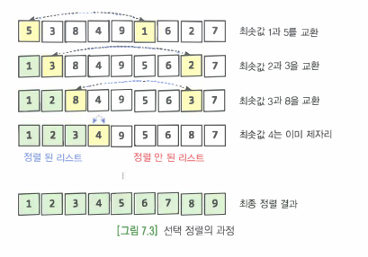

### 구현 복잡도와 알고리즘 효율성에 따른 분류  
- 단순 / 비효율 : 삽입/선택/버블 정렬
- 복잡 / 효율 : 퀵/힙/병합/기수 정렬 

### 안정성에 따른 분류  
- 안정성 : 입력 데이터에 돌일한 킷값을 갖는 레코드가 여러 개 존재할 경우, 정렬 후에도 이들의 상대적인 위치가 변하지않는 것
- __삽입/버블/병합 정렬__  

### 간단한 정렬 알고리즘  
1. 선택정렬
    - 가장 작은 숫자를 선택해서 앞(뒤)쪽으로 옮기는 정렬 
    - 오른쪽(왼쪽)에서 가장 작은 숫자를 선택하여 리스트의 맨 앞(뒤)로 이동하는 작업 반복  
    